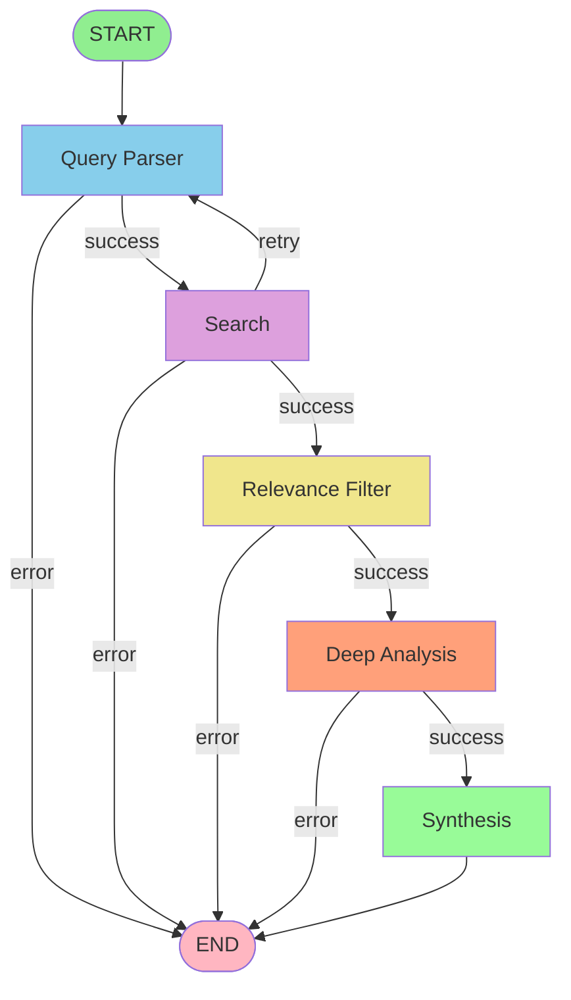

# Tutorial 5: Graph Design & Control Flow

## Introduction

This tutorial explores the architecture of our Deep Research Agent's LangGraph state machine. We'll examine why each node exists, how they connect, and the decision logic that makes the agent intelligent.

## Graph Architecture Overview

Our agent uses a **directed acyclic graph (DAG)** with conditional edges that enable retry logic. Here's the high-level structure:

```
START
  ↓
query_parser (Enhance the query)
  ↓
search (Find documentation)
  ↓ ↺ (retry if needed)
relevance_filter (Keep only relevant results)
  ↓
deep_analysis (Extract structured info)
  ↓
synthesis (Create final guide)
  ↓
END
```

## Visual Graph Diagram



## Node-by-Node Breakdown

### 1. Query Parser Node

**Purpose:** Transform user input into optimized search query

**Code:** `src/agent/graph.ts` - `parseQuery()`

```typescript
async function parseQuery(state: AgentState): Promise<Partial<AgentState>> {
  console.log("📝 Parsing query:", state.query);
  
  try {
    const llm = createLLM();
    const prompt = await QUERY_ENHANCEMENT_PROMPT.format({
      query: state.query,
    });
    
    const response = await llm.invoke([new HumanMessage(prompt)]);
    const enhancedQuery = response.content.toString().trim();
    
    return {
      enhancedQuery,
      status: "searching",
      messages: [new HumanMessage(state.query), new AIMessage(enhancedQuery)],
    };
  } catch (error) {
    return {
      status: "error",
      error: `Query parsing failed: ${error.message}`,
    };
  }
}
```

**Why this node?**
- Raw user queries often lack context
- "spring boot 2 to 3" → "Spring Boot 2 to 3 migration guide official documentation"
- Better queries = better search results

**State Changes:**
- Reads: `query`
- Writes: `enhancedQuery`, `status`, `messages`

**Possible Outcomes:**
- Success → go to `search`
- Error → go to `END`

### 2. Search Node

**Purpose:** Execute internet search using Tavily

**Code:** `src/agent/graph.ts` - `search()`

```typescript
async function search(state: AgentState): Promise<Partial<AgentState>> {
  const query = state.enhancedQuery || state.query;
  
  try {
    const searchResults = await executeSearch(query);
    
    // Validate result quality
    if (!validateSearchResults(searchResults)) {
      // Retry logic
      if (state.searchAttempts < 2) {
        return {
          searchAttempts: state.searchAttempts + 1,
          status: "parsing_query",
          enhancedQuery: `${query} official documentation breaking changes`,
        };
      }
      
      return {
        status: "error",
        error: "Could not find sufficient results",
      };
    }
    
    return {
      searchResults,
      status: "filtering_results",
    };
  } catch (error) {
    return {
      status: "error",
      error: `Search failed: ${error.message}`,
    };
  }
}
```

**Why this node?**
- Connects to external world (Tavily API)
- Implements retry logic for poor results
- Tracks attempts to prevent infinite loops

**State Changes:**
- Reads: `enhancedQuery`, `query`, `searchAttempts`
- Writes: `searchResults`, `searchAttempts`, `status`, `error`

**Possible Outcomes:**
- Success → go to `relevance_filter`
- Insufficient results (attempts < 2) → retry via `query_parser`
- Insufficient results (attempts ≥ 2) → go to `END` with error
- API error → go to `END` with error

**Retry Pattern:**
This is a key feature! When results are poor:
1. First attempt: Re-parse query with additional context
2. Second attempt: Another try with expanded query
3. Third attempt: Give up gracefully

### 3. Relevance Filter Node

**Purpose:** Use LLM to identify most relevant results

**Code:** `src/agent/graph.ts` - `filterRelevance()`

```typescript
async function filterRelevance(state: AgentState): Promise<Partial<AgentState>> {
  try {
    const llm = createLLM();
    
    // Format results for LLM
    const resultsText = state.searchResults!
      .map((result, idx) => 
        `[${idx}] ${result.title}\nURL: ${result.url}\nContent: ${result.content.substring(0, 300)}...`
      )
      .join("\n\n");
    
    const prompt = await RELEVANCE_FILTER_PROMPT.format({
      query: state.query,
      results: resultsText,
    });
    
    const response = await llm.invoke([new HumanMessage(prompt)]);
    const content = response.content.toString().trim();
    
    // Parse indices
    let relevantIndices: number[];
    try {
      relevantIndices = JSON.parse(content);
    } catch (e) {
      // Fallback: use top results by score
      relevantIndices = state.searchResults!
        .map((_, idx) => idx)
        .sort((a, b) => state.searchResults![b].score - state.searchResults![a].score)
        .slice(0, 5);
    }
    
    const relevantResults = relevantIndices
      .filter((idx) => idx >= 0 && idx < state.searchResults!.length)
      .map((idx) => state.searchResults![idx]);
    
    return {
      relevantResults,
      status: "analyzing",
    };
  } catch (error) {
    // Graceful fallback
    const topResults = state.searchResults!
      .sort((a, b) => b.score - a.score)
      .slice(0, 5);
    
    return {
      relevantResults: topResults,
      status: "analyzing",
    };
  }
}
```

**Why this node?**
- Tavily scores aren't perfect
- LLM can understand semantic relevance better
- Reduces noise for analysis phase

**State Changes:**
- Reads: `searchResults`, `query`
- Writes: `relevantResults`, `status`

**Fallback Strategy:**
If LLM filtering fails, fall back to score-based sorting. This ensures robustness.

**Possible Outcomes:**
- Success → go to `deep_analysis`
- Error (with fallback) → still go to `deep_analysis`

### 4. Deep Analysis Node

**Purpose:** Extract structured information from each result

**Code:** `src/agent/graph.ts` - `analyzeResults()`

```typescript
async function analyzeResults(state: AgentState): Promise<Partial<AgentState>> {
  const llm = createLLM();
  const analysisSteps = [];
  
  // Analyze top 3 results
  const resultsToAnalyze = state.relevantResults!.slice(0, 3);
  
  for (const result of resultsToAnalyze) {
    const prompt = await DEEP_ANALYSIS_PROMPT.format({
      query: state.query,
      content: result.content,
    });
    
    const response = await llm.invoke([new HumanMessage(prompt)]);
    const analysis = response.content.toString().trim();
    
    analysisSteps.push({
      step: `Analysis of: ${result.title}`,
      findings: analysis,
      confidence: result.score,
    });
  }
  
  return {
    analysisSteps,
    status: "synthesizing",
  };
}
```

**Why this node?**
- Extracts structured data (steps, changes, examples)
- Analyzes multiple sources independently
- Builds foundation for synthesis

**State Changes:**
- Reads: `relevantResults`, `query`
- Writes: `analysisSteps`, `status`

**Design Decision:**
We analyze only top 3 results to:
- Control LLM API costs
- Focus on highest-quality sources
- Maintain reasonable execution time

**Possible Outcomes:**
- Success → go to `synthesis`
- Error → go to `END`

### 5. Synthesis Node

**Purpose:** Combine all analyses into final migration guide

**Code:** `src/agent/graph.ts` - `synthesizeFindings()`

```typescript
async function synthesizeFindings(state: AgentState): Promise<Partial<AgentState>> {
  try {
    const llm = createLLM();
    
    // Combine analyses
    const analysesText = state.analysisSteps!
      .map((step) => `${step.step}:\n${step.findings}`)
      .join("\n\n---\n\n");
    
    const prompt = await SYNTHESIS_PROMPT.format({
      query: state.query,
      sourceCount: state.analysisSteps!.length,
      analyses: analysesText,
    });
    
    const response = await llm.invoke([new HumanMessage(prompt)]);
    const synthesisJson = response.content.toString().trim();
    
    // Parse synthesis
    let synthesis = JSON.parse(synthesisJson);
    
    // Extract sources
    const sources = state.relevantResults!.slice(0, 5).map((r) => r.url);
    
    const findings = {
      summary: synthesis.summary,
      migrationSteps: synthesis.migrationSteps || [],
      breakingChanges: synthesis.breakingChanges || [],
      examples: synthesis.examples || synthesis.notes || [],
      sources,
    };
    
    return {
      findings,
      status: "complete",
    };
  } catch (error) {
    return {
      status: "error",
      error: `Synthesis failed: ${error.message}`,
    };
  }
}
```

**Why this node?**
- Combines information from multiple sources
- Creates coherent, unified guide
- Formats for final presentation

**State Changes:**
- Reads: `analysisSteps`, `relevantResults`, `query`
- Writes: `findings`, `status`

**Possible Outcomes:**
- Success → go to `END` (status: complete)
- Error → go to `END` (status: error)

## Edge Configuration

### Fixed Edges

```typescript
graph.addEdge(START, "query_parser");
graph.addEdge("synthesis", END);
```

These are unconditional - they always flow the same way.

### Conditional Edges

```typescript
// After query_parser
graph.addConditionalEdges("query_parser", (state: AgentState) => {
  if (state.status === "error") return END;
  return "search";
});

// After search (with retry logic)
graph.addConditionalEdges("search", (state: AgentState) => {
  if (state.status === "error") return END;
  if (state.status === "parsing_query") return "query_parser"; // RETRY
  return "relevance_filter";
});

// After relevance_filter
graph.addConditionalEdges("relevance_filter", (state: AgentState) => {
  if (state.status === "error") return END;
  return "deep_analysis";
});

// After deep_analysis
graph.addConditionalEdges("deep_analysis", (state: AgentState) => {
  if (state.status === "error") return END;
  return "synthesis";
});
```

**Key Pattern:**
Every node checks for `status === "error"` to gracefully exit on failure.

## Control Flow Patterns

### 1. Error Propagation

```typescript
// In any node
try {
  // ... do work
  return { status: "next_step", data: result };
} catch (error) {
  return {
    status: "error",
    error: error.message,
  };
}

// In conditional edge
graph.addConditionalEdges("node", (state) => {
  if (state.status === "error") return END;
  // ... other logic
});
```

### 2. Retry with Limit

```typescript
// In node
if (needsRetry && state.attempts < MAX_ATTEMPTS) {
  return {
    attempts: state.attempts + 1,
    status: "retry_state",
  };
}

// In conditional edge
if (state.status === "retry_state") {
  return "previous_node"; // Loop back
}
```

### 3. Fallback Strategies

```typescript
try {
  // Primary approach
  const result = await primaryMethod();
  return { data: result };
} catch (error) {
  // Fallback approach
  const result = fallbackMethod();
  return { data: result };
}
```

## Graph Execution Flow

### Example: Successful Execution

```
1. START
   State: { query: "React 17 to 18", status: "parsing_query" }

2. query_parser
   State: { ..., enhancedQuery: "React 17 to 18 migration...", status: "searching" }

3. search
   State: { ..., searchResults: [...], status: "filtering_results" }

4. relevance_filter
   State: { ..., relevantResults: [...], status: "analyzing" }

5. deep_analysis
   State: { ..., analysisSteps: [...], status: "synthesizing" }

6. synthesis
   State: { ..., findings: {...}, status: "complete" }

7. END
   Final state returned to caller
```

### Example: With Retry

```
1. START → query_parser → search
   State: { ..., searchResults: [only 1 poor result], searchAttempts: 0 }

2. search detects poor results
   State: { ..., searchAttempts: 1, status: "parsing_query", enhancedQuery: "...official..." }

3. Back to query_parser (RETRY)
   State: { ..., enhancedQuery: "...official documentation...", status: "searching" }

4. search again
   State: { ..., searchResults: [10 good results], status: "filtering_results" }

5. Continue normally...
```

## Design Decisions

### Why Not a Simple Chain?

A chain would be linear:
```
query → search → analyze → synthesize
```

But we need:
- **Conditional retry** in search
- **Graceful error handling** at each step
- **Fallback strategies** in filtering
- **State-based routing**

Graphs provide this flexibility.

### Why These Specific Nodes?

Each node has a single, clear responsibility:

1. **query_parser** - Input transformation
2. **search** - External data retrieval
3. **relevance_filter** - Quality filtering
4. **deep_analysis** - Information extraction
5. **synthesis** - Information combination

This follows the **Single Responsibility Principle**.

### Why Limit to 3 Sources?

Balancing:
- **Quality** - Focus on best sources
- **Cost** - Each LLM call costs money
- **Time** - User wants fast results
- **Comprehensiveness** - 3 sources usually sufficient

## Alternative Designs

### Parallel Analysis

Instead of sequential analysis, analyze all sources in parallel:

```typescript
const analyses = await Promise.all(
  relevantResults.map(result => analyzeResult(result))
);
```

**Trade-offs:**
- ✅ Faster execution
- ✅ Better resource utilization
- ❌ Higher peak API usage
- ❌ More complex error handling

### Iterative Refinement

Add a loop to refine the guide:

```
synthesis → review → (if unsatisfactory) → search_more → synthesis
```

**Trade-offs:**
- ✅ Higher quality output
- ✅ Can handle complex cases
- ❌ Much longer execution time
- ❌ Higher cost
- ❌ Risk of infinite loops

### Human-in-the-Loop

Add approval steps:

```
synthesis → await_human_approval → (if rejected) → refine
```

**Trade-offs:**
- ✅ Human oversight
- ✅ Catches errors
- ❌ Not fully automated
- ❌ Breaks CLI flow

## Key Takeaways

1. **Graphs** enable complex control flow with branches and loops
2. **Conditional edges** make intelligent routing decisions
3. **Status tracking** drives the flow through the graph
4. **Error handling** at each node ensures robustness
5. **Retry logic** improves success rates
6. **Fallback strategies** provide graceful degradation
7. **Single responsibility** per node keeps code clean

## Next Steps

Now let's explore how to build the CLI interface using React and Ink.

Continue to: [Tutorial 6: React & Ink for CLI](./06-react-ink-basics.md)

