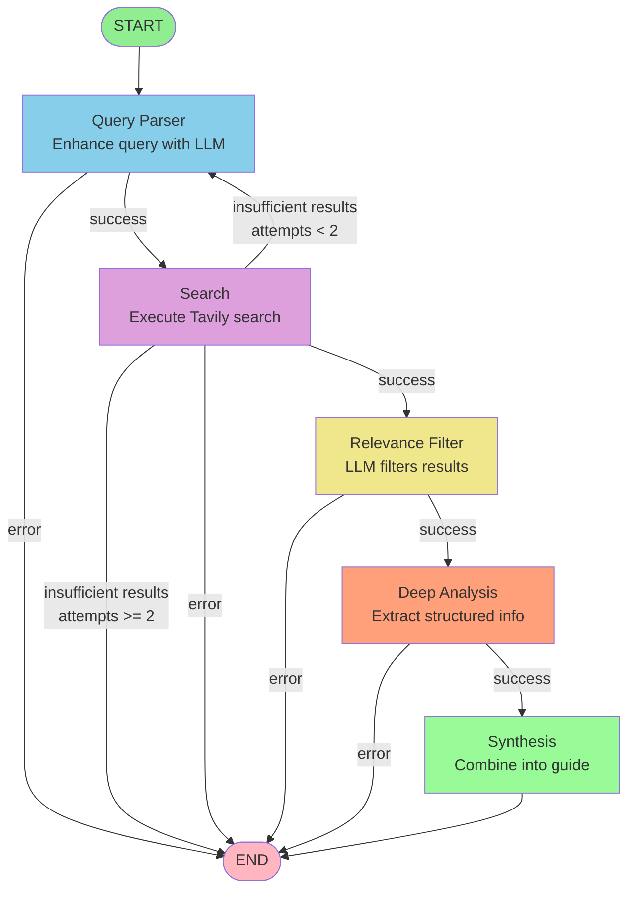

# Deep Research Agent - Graph Architecture Reference

## Complete Graph Structure



## State Transitions

### State Schema

```typescript
{
  // Input
  query: string,                              // User's query
  
  // Processing
  enhancedQuery?: string,                     // LLM-enhanced query
  searchResults?: SearchResult[],             // Raw search results
  relevantResults?: SearchResult[],           // Filtered results
  analysisSteps?: AnalysisStep[],            // Individual analyses
  
  // Output
  findings?: MigrationFindings,              // Final structured guide
  
  // Metadata
  messages: BaseMessage[],                    // LLM conversation history
  status: AgentStatus,                        // Current processing status
  error?: string,                            // Error message if any
  searchAttempts: number,                    // Retry counter
}
```

### Status Flow

```
idle → parsing_query → searching → filtering_results → analyzing → synthesizing → complete
                                ↓
                             error
```

## Node Functions

### 1. Query Parser

```typescript
Input:  { query, status: "parsing_query" }
Action: Call LLM to enhance query
Output: { enhancedQuery, status: "searching", messages }
```

**Purpose:** Transform "Spring Boot 2 to 3" into "Spring Boot 2 to 3 migration guide official documentation breaking changes"

### 2. Search

```typescript
Input:  { enhancedQuery, status: "searching" }
Action: Execute Tavily search
Output: { searchResults, status: "filtering_results" }
        OR retry via { searchAttempts++, status: "parsing_query" }
```

**Purpose:** Find relevant documentation on the internet

**Retry Logic:**
- Attempt 1: Use enhanced query
- Attempt 2: Add "official documentation breaking changes"
- Attempt 3: Give up gracefully

### 3. Relevance Filter

```typescript
Input:  { searchResults, status: "filtering_results" }
Action: LLM evaluates relevance of each result
Output: { relevantResults, status: "analyzing" }
```

**Purpose:** Keep only migration-relevant documentation (not blogs, ads, etc.)

### 4. Deep Analysis

```typescript
Input:  { relevantResults, status: "analyzing" }
Action: LLM extracts structured info from top 3 results
Output: { analysisSteps, status: "synthesizing" }
```

**Purpose:** Extract migration steps, breaking changes, examples from each source

### 5. Synthesis

```typescript
Input:  { analysisSteps, status: "synthesizing" }
Action: LLM combines all analyses into coherent guide
Output: { findings, status: "complete" }
```

**Purpose:** Create unified migration guide from multiple sources

## Edge Conditions

### Successful Path

```
query_parser (success)
    → search (success)
    → relevance_filter (success)
    → deep_analysis (success)
    → synthesis (success)
    → END
```

### Retry Path

```
query_parser
    → search (insufficient results, attempt 1)
    ↑─────┘ (retry with enhanced query)
    → search (success)
    → ...continue normally
```

### Error Path

```
query_parser
    → search (API error)
    → END (with error in state)
```

## Data Flow Example

### Initial State
```json
{
  "query": "Spring Boot 2 to 3",
  "status": "parsing_query",
  "searchAttempts": 0,
  "messages": []
}
```

### After query_parser
```json
{
  "query": "Spring Boot 2 to 3",
  "enhancedQuery": "Spring Boot 2 to 3 migration guide official",
  "status": "searching",
  "searchAttempts": 0,
  "messages": [HumanMessage, AIMessage]
}
```

### After search
```json
{
  ...previous,
  "searchResults": [
    {
      "title": "Spring Boot 3.0 Migration Guide",
      "url": "https://spring.io/...",
      "content": "Spring Boot 3 requires...",
      "score": 0.95
    }
    // ... 9 more results
  ],
  "status": "filtering_results"
}
```

### After relevance_filter
```json
{
  ...previous,
  "relevantResults": [
    // Top 5 relevant results
  ],
  "status": "analyzing"
}
```

### After deep_analysis
```json
{
  ...previous,
  "analysisSteps": [
    {
      "step": "Analysis of: Spring Boot 3.0 Migration Guide",
      "findings": "{\"migrationSteps\":[...],\"breakingChanges\":[...]}",
      "confidence": 0.95
    }
    // ... 2 more analyses
  ],
  "status": "synthesizing"
}
```

### Final State
```json
{
  ...previous,
  "findings": {
    "summary": "Spring Boot 3 requires Java 17...",
    "migrationSteps": [
      "Upgrade to Java 17",
      "Update Spring Boot version",
      ...
    ],
    "breakingChanges": [
      "javax to jakarta migration",
      ...
    ],
    "examples": [...],
    "sources": [
      "https://spring.io/...",
      ...
    ]
  },
  "status": "complete"
}
```

## Performance Characteristics

### Time Complexity
- Query Parser: 2-3 seconds (1 LLM call)
- Search: 2-5 seconds (1 API call)
- Relevance Filter: 3-5 seconds (1 LLM call with long input)
- Deep Analysis: 6-12 seconds (3 LLM calls)
- Synthesis: 4-6 seconds (1 LLM call)

**Total: 17-31 seconds for typical query**

### API Usage
- LLM calls: 6-7 per query
- Search API calls: 1-3 (with retries)
- Approximate cost: $0.10-0.20 per query

### Optimization Opportunities
1. **Parallel Analysis** - Analyze sources concurrently (saves 4-8 seconds)
2. **Caching** - Cache search results for similar queries
3. **Streaming** - Stream LLM responses for perceived speed
4. **Batching** - Batch multiple analyses in one LLM call

## Error Handling

### Node-Level Errors
Each node catches errors and stores in state:
```typescript
try {
  // ... node logic
} catch (error) {
  return { status: "error", error: error.message };
}
```

### Graph-Level Routing
Conditional edges check for error status:
```typescript
if (state.status === "error") return END;
```

### User-Facing Errors
UI displays error gracefully:
```typescript
{error && <ErrorDisplay error={error} />}
```

## Extension Points

### Adding a Node
1. Define node function
2. Update state schema
3. Add node to graph
4. Configure edges
5. Update UI to display new data

### Adding a Tool
1. Create tool function in `src/agent/tools/`
2. Call from existing or new node
3. Update state schema if needed

### Modifying Prompts
1. Edit prompt in `src/agent/llm.ts`
2. Test with various inputs
3. Iterate based on results

## References

- LangGraph Documentation: https://langchain-ai.github.io/langgraphjs/
- State Machine Pattern: https://en.wikipedia.org/wiki/Finite-state_machine
- Agent Design Patterns: https://www.patterns.dev/posts/agent-pattern

